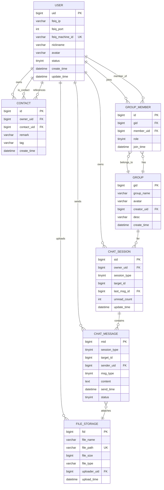

# 飞秋通讯 - 基于 Tauri 2.0 的内网通讯软件架构文档

> **版本**: v1.0.0
> **更新日期**: 2025-01-27
> **文档状态**: 架构设计阶段

---

## 目录

1. [项目概述](#一项目概述)
2. [需求分析](#二需求分析)
3. [实施路线图](#三实施路线图)
4. [技术栈解析](#四技术栈解析)
5. [系统架构设计](#五系统架构设计)
6. [数据库设计](#六数据库设计)
7. [核心流程设计](#七核心流程设计)
8. [接口设计](#八接口设计)
9. [安全与性能](#九安全与性能)
10. [开发规范](#十开发规范)
11. [部署与测试](#十一部署与测试)
12. [参考实现分析](#十二参考实现分析)
13. [附录](#附录)
   - 13.1 [术语表](#a术语表)
   - 13.2 [参考资料](#b参考资料)
   - 13.3 [常见问题](#c常见问题)

---

## 一、项目概述


### 1.1 项目简介

飞秋通讯是一款基于飞秋（FeiQ）内网通信协议的桌面端即时通讯软件，采用 Tauri 2.0 框架构建，融合 Rust 高性能后端与 React 现代化前端，提供仿微信的交互体验。

### 1.2 核心特性

| 特性类别 | 功能描述 |
|---------|---------|
| 基础通信 | 内网点对点/广播消息收发、在线状态同步 |
| 聊天功能 | 单聊、群聊、文字/Emoji 消息、消息持久化 |
| 文件传输 | 单/群聊文件上传、断点续传、传输进度展示 |
| 用户体验 | 仿微信界面、通讯录分组、最近会话、未读消息提醒 |
| 技术特性 | 跨平台支持、轻量部署、内存安全、高性能异步处理 |

### 1.3 技术亮点

- **跨平台**: 基于 Tauri 2.0，支持 Windows/macOS/Linux
- **高性能**: Rust 异步运行时 Tokio + 零成本抽象
- **轻量级**: 无需独立服务器，SQLite 本地存储，应用体积 < 20MB
- **安全性**: Rust 内存安全保证 + Tauri 安全沙箱机制

---

## 二、需求分析


### 2.1 功能需求

#### 2.1.1 用户管理
- [ ] 用户自动发现（内网广播）
- [ ] 在线状态维护
- [ ] 用户信息展示（昵称、头像、状态）

#### 2.1.2 通讯录管理
- [ ] 联系人添加/删除
- [ ] 备注名修改
- [ ] 分组标签管理
- [ ] 联系人搜索

#### 2.1.3 即时通讯
- [ ] 单人聊天
- [ ] 群组聊天（创建、加入、退出）
- [ ] 文字消息发送/接收
- [ ] Emoji 表情发送
- [ ] 消息历史记录
- [ ] 未读消息计数

#### 2.1.4 文件传输
- [ ] 单聊文件发送
- [ ] 群聊文件发送
- [ ] 传输进度展示
- [ ] 断点续传
- [ ] 文件管理

### 2.2 非功能需求

| 需求类别 | 具体要求 | 验收标准 |
|---------|---------|---------|
| 性能 | 消息延迟 < 200ms | 压力测试通过 |
| 并发 | 支持 100+ 在线用户 | 模拟测试验证 |
| 稳定性 | 7×24 小时稳定运行 | 长期运行测试 |
| 兼容性 | Win10+/macOS 10.15+/Ubuntu 20.04+ | 平台测试通过 |
| 安全性 | 本地数据加密存储 | 安全审计通过 |

### 2.3 约束条件

- 单文件代码行数不超过 500 行
- 严格遵循单一职责原则
- 包名命名符合 Rust/React 规范
- 数据库操作必须使用 ORM（SeaORM）

---

## 三、实施路线图


### 3.1 分阶段实施策略

基于敏捷开发理念，采用"先核心后扩展"的策略，确保每个阶段都有可验证的交付物。

### 3.2 阶段规划

#### 第一阶段：项目搭建 + 飞秋协议基础（Week 1-2）

**目标**: 完成开发环境搭建，实现飞秋协议的基础通信功能

| 任务项 | 优先级 | 预计工时 | 交付物 |
|--------|--------|---------|--------|
| 项目初始化 | P0 | 0.5天 | Tauri + React 项目骨架 |
| 飞秋协议解析模块 | P0 | 2天 | 协议编解码（parser.rs, packer.rs） |
| UDP 收发模块 | P0 | 1.5天 | UDP Socket 绑定、异步收发 |
| 在线发现功能 | P0 | 1天 | BR_ENTRY/ANSENTRY 处理 |
| 文字消息收发 | P0 | 2天 | SENDMSG/RECVMSG 处理 |
| 数据库表结构 | P0 | 1天 | SeaORM 模型 + Migration 脚本 |

**验收标准**:
- [ ] 两台内网机器能互相发现对方上线
- [ ] 能发送并接收文字消息，消息正确存储到数据库
- [ ] 所有单元测试通过

---

#### 第二阶段：前端核心界面（Week 3-4）

**目标**: 完成仿微信风格的核心 UI 组件

| 任务项 | 优先级 | 预计工时 | 交付物 |
|--------|--------|---------|--------|
| 基础布局框架 | P0 | 1天 | 三栏布局（通讯录+会话+聊天） |
| 通讯录组件 | P0 | 2天 | 用户列表、搜索、分组 |
| 聊天窗口组件 | P0 | 3天 | 消息列表、输入框、发送 |
| 最近会话列表 | P0 | 2天 | 会话展示、未读标识 |
| IPC 接口对接 | P0 | 2天 | 前后端通信打通 |
| 仿微信样式 | P1 | 2天 | 配色、字体、间距 |

**验收标准**:
- [ ] 界面布局与微信高度相似
- [ ] 能在前端看到在线用户列表
- [ ] 能发送消息并在前端显示

---

#### 第三阶段：消息功能完善（Week 5-6）

**目标**: 完善消息相关的高级功能

| 任务项 | 优先级 | 预计工时 | 交付物 |
|--------|--------|---------|--------|
| Emoji 表情功能 | P1 | 2天 | Emoji 选择器、发送 |
| 消息已读回执 | P1 | 1.5天 | READMSG/ANSREADMSG 处理 |
| 消息历史分页 | P1 | 1天 | 分页加载优化 |
| 消息状态管理 | P1 | 1.5天 | 发送中/已发送/已读状态 |
| 离线消息处理 | P1 | 1天 | 离线消息缓存 |

**验收标准**:
- [ ] 能选择并发送 Emoji
- [ ] 能看到消息已读状态
- [ ] 滚动加载历史消息

---

#### 第四阶段：文件传输功能（Week 7-8）

**目标**: 实现单聊和群聊的文件传输

| 任务项 | 优先级 | 预计工时 | 交付物 |
|--------|--------|---------|--------|
| 文件请求/确认 | P0 | 1.5天 | GETFILEDATA 处理 |
| 文件分块传输 | P0 | 2.5天 | 分块发送、重组、校验 |
| 文件上传组件 | P0 | 2天 | 文件选择、上传 |
| 传输进度展示 | P1 | 1天 | 进度条、速度显示 |
| 断点续传 | P1 | 2天 | 传输状态保存和恢复 |
| 群聊文件传输 | P1 | 1.5天 | 多目标发送 |

**验收标准**:
- [ ] 能发送文件并成功接收
- [ ] 传输进度实时更新
- [ ] 传输中断后能断点续传

---

#### 第五阶段：群聊功能（Week 9-10）

**目标**: 完成群组创建、管理和群聊消息

| 任务项 | 优先级 | 预计工时 | 交付物 |
|--------|--------|---------|--------|
| 群组创建功能 | P0 | 1.5天 | 创建群组、添加成员 |
| 群组成员管理 | P0 | 2天 | 添加/移除成员、角色管理 |
| 群聊消息分发 | P0 | 2天 | 消息广播、去重 |
| 群组信息展示 | P1 | 1天 | 群成员列表、群设置 |
| 群聊 UI 适配 | P1 | 1.5天 | 群聊界面优化 |

**验收标准**:
- [ ] 能创建群组并邀请成员
- [ ] 群消息能正确广播到所有成员
- [ ] 群成员管理功能正常

---

#### 第六阶段：优化与测试（Week 11-12）

**目标**: 性能优化、稳定性测试、bug 修复

| 任务项 | 优先级 | 预计工时 | 交付物 |
|--------|--------|---------|--------|
| UDP 丢包重传优化 | P0 | 2天 | 重传机制完善 |
| 性能压测 | P0 | 2天 | 模拟 100+ 用户并发 |
| 内存泄漏检查 | P0 | 1天 | Valgrind/LeakSanitizer 检查 |
| 前端性能优化 | P1 | 2天 | 虚拟滚动、懒加载 |
| 跨平台测试 | P0 | 2天 | Win/macOS/Linux 测试 |
| Bug 修复 | P0 | 3天 | 问题修复 |

**验收标准**:
- [ ] 压力测试通过（100+ 用户）
- [ ] 跨平台功能一致性
- [ ] 无内存泄漏

---

### 3.3 技术实施要点

#### 3.3.1 飞秋协议实施顺序

```
核心路径（必须）:
  BR_ENTRY → ANSENTRY          (在线发现)
  SENDMSG → RECVMSG            (消息收发)
  GETFILEDATA → RELEASEFILES   (文件传输)

扩展路径（可选）:
  READMSG → ANSREADMSG         (已读回执)
  GETLIST → ANSLIST            (用户列表)
  GETPUBKEY → ANSPUBKEY        (加密通信)
```

#### 3.3.2 数据库迁移管理

```bash
# 安装 sea-orm-cli
cargo install sea-orm-cli

# 初始化迁移
sea-orm-cli migrate init

# 创建新迁移
sea-orm-cli migrate generate create_user_table

# 执行迁移
sea-orm-cli migrate up

# 回滚迁移
sea-orm-cli migrate down
```

**迁移版本管理:**
```
migrations/
├── m20240101_000001_create_user_table.rs
├── m20240101_000002_create_contact_table.rs
├── m20240101_000003_create_group_tables.rs
├── m20240102_000004_create_chat_tables.rs
└── m20240103_000005_create_file_storage_table.rs
```

#### 3.3.3 测试策略

**单元测试** - 每个模块独立测试
```rust
#[cfg(test)]
mod tests {
    #[tokio::test]
    async fn test_parse_feiq_packet() {
        let data = b"1.0:32:sender:receiver:123:Hello";
        let packet = parse_feiq_packet(data).unwrap();
        assert_eq!(packet.cmd, IPMSG_SENDMSG);
    }
}
```

**集成测试** - 端到端通信测试
```rust
// tests/integration_test.rs
#[tokio::test]
async fn test_online_discovery() {
    // 启动两个客户端实例
    // 验证互相发现
}
```

**压力测试** - UDP 丢包场景
```bash
# 模拟 10% 丢包率
tc qdisc add dev eth0 root netem loss 10%

# 发送 1000 条消息验证重传机制
```

---

### 3.4 里程碑与交付

| 里程碑 | 时间点 | 关键交付物 | 验收方式 |
|--------|--------|-----------|---------|
| M1: 协议基础 | Week 2 | UDP 通信、在线发现、文字消息 | 局域网两机通信测试 |
| M2: 前端界面 | Week 4 | 仿微信核心 UI | UI 走查 |
| M3: 消息完善 | Week 6 | Emoji、已读回执 | 功能演示 |
| M4: 文件传输 | Week 8 | 单聊/群聊文件传输 | 文件收发测试 |
| M5: 群聊功能 | Week 10 | 群组管理、群聊 | 多人群聊测试 |
| M6: 版本发布 | Week 12 | v1.0.0 安装包 | 完整功能测试 |

---

### 3.5 风险与应对

| 风险 | 影响 | 概率 | 应对措施 |
|------|------|------|---------|
| UDP 丢包率高 | 高 | 中 | 实现 ACK+超时重传、消息去重 |

| 跨平台兼容性 | 中 | 高 | 早期跨平台测试、抽象平台差异 |
| 性能瓶颈 | 中 | 中 | 异步处理、连接池、虚拟滚动 |
| 协议兼容性 | 低 | 低 | 严格遵循 IPMsg 协议规范 |

## 四、技术栈解析


### 4.1 技术架构全景图

```
┌─────────────────────────────────────────────────────────────┐
│                      前端层 (Frontend)                       │
├─────────────────────────────────────────────────────────────┤
│  React 18 + TypeScript + Less + Ant Design/仿微信UI         │
│  ┌──────────┐ ┌──────────┐ ┌──────────┐ ┌──────────┐       │
│  │通讯录组件│ │聊天窗口  │ │Emoji选择 │ │文件上传  │       │
│  └──────────┘ └──────────┘ └──────────┘ └──────────┘       │
│                     ↓ IPC 调用                              │
└─────────────────────────────────────────────────────────────┘
                           ↓
┌─────────────────────────────────────────────────────────────┐
│              Tauri IPC Bridge (事件总线)                     │
└─────────────────────────────────────────────────────────────┘
                           ↓
┌─────────────────────────────────────────────────────────────┐
│                      后端层 (Backend)                        │
├─────────────────────────────────────────────────────────────┤
│  Rust + Tokio (异步运行时)                                  │
│  ┌────────────┐  ┌────────────┐  ┌────────────┐            │
│  │ 网络通信层  │  │  业务逻辑层 │  │  数据访问层 │            │
│  │ UDP/FeiQ   │  │ Chat/File  │  │ SeaORM/DB  │            │
│  └────────────┘  └────────────┘  └────────────┘            │
└─────────────────────────────────────────────────────────────┘
                           ↓
┌─────────────────────────────────────────────────────────────┐
│                   数据存储层 (Storage)                       │
├─────────────────────────────────────────────────────────────┤
│  SQLite (本地数据库) + 文件系统 (头像/文件)                 │
└─────────────────────────────────────────────────────────────┘
```

### 4.2 核心技术栈详解

#### 4.2.1 飞秋（IPMsg）通信协议

飞秋基于 **UDP 协议**（默认端口 2425）实现内网点对点/广播通信，遵循 IPMsg (IP Messenger) 协议规范。

##### 协议格式

```
版本号:命令字:发送者信息:接收者信息:消息编号:附加信息
```

| 字段 | 说明 | 示例 |
|------|------|------|
| 版本号 | 固定为 1.0 | `1.0` |
| 命令字 | mode 低 8 位（命令）+ 高 24 位（选项标志） | `0x00000021` (RECVMSG) |
| 发送者信息 | 格式: `用户名@机器名/IP:端口\|MAC地址` | `admin@PC-001/192.168.1.100:2425\|AA:BB:CC:DD:EE:FF` |
| 接收者信息 | 目标用户信息（广播时为空） | - |
| 消息编号 | 消息序列号（用于去重和确认） | `12345` |
| 附加信息 | 消息内容/文件信息（扩展字段） | `Hello World` |

##### 命令字定义（Command - mode 低 8 位）

| 命令字 | 值 | 说明 |
|--------|-----|------|
| **基础通信** |||
| `IPMSG_NOOPERATION` | 0x00000000 | 无操作 |
| `IPMSG_BR_ENTRY` | 0x00000001 | 广播上线 |
| `IPMSG_BR_EXIT` | 0x00000002 | 广播下线 |
| `IPMSG_ANSENTRY` | 0x00000003 | 对 BR_ENTRY 的应答 |
| `IPMSG_BR_ABSENCE` | 0x00000004 | 广播缺席 |
| **用户列表** |||
| `IPMSG_BR_ISGETLIST` | 0x00000010 | 请求是否需要列表 |
| `IPMSG_OKGETLIST` | 0x00000011 | 同意发送列表 |
| `IPMSG_GETLIST` | 0x00000012 | 请求用户列表 |
| `IPMSG_ANSLIST` | 0x00000013 | 返回用户列表 |
| `IPMSG_BR_ISGETLIST2` | 0x00000018 | 请求扩展列表 |
| **消息相关** |||
| `IPMSG_SENDMSG` | 0x00000020 | 发送消息 |
| `IPMSG_RECVMSG` | 0x00000021 | 接收确认 |
| `IPMSG_READMSG` | 0x00000030 | 消息已读 |
| `IPMSG_DELMSG` | 0x00000031 | 删除消息 |
| `IPMSG_ANSREADMSG` | 0x00000032 | 对已读的应答 |
| **用户信息** |||
| `IPMSG_GETINFO` | 0x00000040 | 请求用户信息 |
| `IPMSG_SENDINFO` | 0x00000041 | 发送用户信息 |
| `IPMSG_GETABSENCEINFO` | 0x00000050 | 请求缺席信息 |
| `IPMSG_SENDABSENCEINFO` | 0x00000051 | 发送缺席信息 |
| **文件传输** |||
| `IPMSG_GETFILEDATA` | 0x00000060 | 请求文件数据 |
| `IPMSG_RELEASEFILES` | 0x00000061 | 释放文件资源 |
| `IPMSG_GETDIRFILES` | 0x00000062 | 请求目录文件列表 |
| **加密通信** |||
| `IPMSG_GETPUBKEY` | 0x00000072 | 请求公钥 |
| `IPMSG_ANSPUBKEY` | 0x00000073 | 应答公钥 |

##### 选项标志（Option/Flags）

**通用/全局标志:**

| 标志 | 值 | 说明 |
|------|-----|------|
| `IPMSG_ABSENCEOPT` | 0x00000100 | 缺席标志 |
| `IPMSG_SERVEROPT` | 0x00000200 | 服务器标志 |
| `IPMSG_DIALUPOPT` | 0x00010000 | 拨号连接标志 |
| `IPMSG_FILEATTACHOPT` | 0x00200000 | 文件附加标志 |
| `IPMSG_ENCRYPTOPT` | 0x00400000 | 加密标志 |
| `IPMSG_UTF8OPT` | 0x00800000 | UTF-8 编码标志 |

**发送命令特有标志:**

| 标志 | 值 | 说明 |
|------|-----|------|
| `IPMSG_SENDCHECKOPT` | 0x00000100 | 发送确认（需要 RECVMSG 应答） |
| `IPMSG_SECRETOPT` | 0x00000200 | 私密发送（密封消息） |
| `IPMSG_BROADCASTOPT` | 0x00000400 | 广播发送 |
| `IPMSG_MULTICASTOPT` | 0x00000800 | 多播发送 |
| `IPMSG_NOPOPUPOPT` | 0x00001000 | 不弹窗（接收端） |
| `IPMSG_AUTORETOPT` | 0x00002000 | 自动回复请求 |
| `IPMSG_RETRYOPT` | 0x00004000 | 重试选项 |
| `IPMSG_PASSWORDOPT` | 0x00008000 | 带密码发送 |
| `IPMSG_NOLOGOPT` | 0x00020000 | 不记录日志 |

##### 命令字组合规则

实际使用时，**命令字 = 基础命令 OR 选项标志**：

```
// 示例1：发送需要确认的 UTF-8 消息
mode = IPMSG_SENDMSG | IPMSG_SENDCHECKOPT | IPMSG_UTF8OPT
     = 0x00000020 | 0x00000100 | 0x00800000
     = 0x00800120

// 示例2：带附件的广播消息
mode = IPMSG_SENDMSG | IPMSG_FILEATTACHOPT | IPMSG_BROADCASTOPT | IPMSG_UTF8OPT
     = 0x00000020 | 0x00200000 | 0x00000400 | 0x00800000
     = 0x00A00420
```

##### 核心交互流程

**1. 在线发现**
```
客户端 A 启动
    ↓
广播 IPMSG_BR_ENTRY (0x00000001)
    ↓
客户端 B 收到 → 回复 IPMSG_ANSENTRY (0x00000003)
    ↓
双方更新用户列表
```

**2. 消息收发**
```
发送方 A:
  mode = IPMSG_SENDMSG | IPMSG_SENDCHECKOPT | IPMSG_UTF8OPT
  发送 UDP 数据包 → 等待 IPMSG_RECVMSG

接收方 B:
  收到消息 → 存储 DB → 发送 IPMSG_RECVMSG (0x00000021)
  (如果设置了 IPMSG_READMSG，用户查看后发送 0x00000030)
```

**3. 文件传输**
```
发送方 A:
  mode = IPMSG_SENDMSG | IPMSG_FILEATTACHOPT | IPMSG_UTF8OPT
  附加信息包含文件元数据: "0:文件名:大小:时间:..."

接收方 B:
  用户确认 → 发送 IPMSG_GETFILEDATA (0x00000060)
  附加信息包含: "数据包序号:文件ID:偏移量:长度"

发送方 A:
  分块发送文件数据（每块 UDP 包）
  完成后发送 IPMSG_RELEASEFILES (0x00000061)
```

**4. 消息已读回执**
```
发送方 A:
  mode = IPMSG_SENDMSG | IPMSG_SENDCHECKOPT | IPMSG_READMSG

接收方 B:
  用户打开消息 → 发送 IPMSG_READMSG (0x00000030)

发送方 A:
  收到 READMSG → 回复 IPMSG_ANSREADMSG (0x00000032)
  更新消息状态为"已读"
```

#### 4.2.2 Tauri 2.0 框架

| 特性 | 说明 | 应用场景 |
|------|------|---------|
| 跨平台 | 一次编译，多平台运行 | Windows/macOS/Linux |
| IPC 通信 | 前后端高效通信机制 | React 调用 Rust 函数 |
| 安全沙箱 | 严格的权限控制 | 文件系统访问限制 |
| 轻量级 | 应用体积小（相比 Electron） | 桌面应用分发 |
| Rust 后端 | 高性能、内存安全 | UDP 通信、文件处理 |

#### 4.2.3 Rust 生态系统

| 技术栈 | 版本要求 | 核心作用 |
|--------|---------|---------|
| **Rust** | 1.75+ | 后端核心开发语言 |
| **Tokio** | 1.35+ | 异步运行时（UDP、文件、数据库异步操作） |
| **SeaORM** | 0.12+ | ORM 框架（数据库 CRUD、迁移、关联查询） |
| **Serde** | 1.0+ | 序列化/反序列化（JSON、数据模型转换） |
| **Tauri** | 2.0+ | 跨平台桌面应用框架 |
| **Sqlite** | 3.40+ | 轻量级本地数据库 |
| **Tracing** | 0.1+ | 结构化日志（调试、问题追踪） |

#### 4.2.4 React 技术栈

| 技术栈 | 版本要求 | 核心作用 |
|--------|---------|---------|
| **React** | 18.2+ | UI 框架（组件化、虚拟 DOM） |
| **TypeScript** | 5.0+ | 类型安全（减少运行时错误） |
| **Less** | 4.1+ | CSS 预处理器（主题定制） |
| **Vite** | 5.0+ | 前端构建工具（快速热更新） |
| **Ant Design** | 5.0+ | UI 组件库（可选，或自建仿微信组件） |

---

## 五、系统架构设计


### 5.1 分层架构

严格遵循 **单一职责、开闭原则、依赖倒置** 三大核心设计原则。

```
┌───────────────────────────────────────────────────────────┐
│                     表现层 (Presentation)                  │
├───────────────────────────────────────────────────────────┤
│  React 组件 + 状态管理 + 路由                              │
│  - 通讯录、聊天窗口、Emoji、文件上传等组件                  │
│  - 全局状态 (React Context/Zustand)                       │
│  - IPC 调用封装                                            │
└───────────────────────────────────────────────────────────┘
                           ↓
┌───────────────────────────────────────────────────────────┐
│                   应用层 (Application)                     │
├───────────────────────────────────────────────────────────┤
│  Tauri IPC 接口层 - 暴露后端能力给前端                     │
│  - 命令注册 (#[tauri::command])                           │
│  - 参数校验                                                │
│  - 错误转换                                                │
└───────────────────────────────────────────────────────────┘
                           ↓
┌───────────────────────────────────────────────────────────┐
│                   业务层 (Domain/Business)                 │
├───────────────────────────────────────────────────────────┤
│  核心业务逻辑（与框架解耦，可独立测试）                     │
│  - Chat: 单聊/群聊消息处理                                 │
│  - Contact: 用户发现、关系管理                             │
│  - File: 文件传输、存储管理                                │
│  - Group: 群组管理、成员管理                               │
└───────────────────────────────────────────────────────────┘
                           ↓
┌───────────────────────────────────────────────────────────┐
│                   数据访问层 (Data Access)                 │
├───────────────────────────────────────────────────────────┤
│  数据库操作抽象                                            │
│  - SeaORM 模型（实体定义）                                 │
│  - 数据库迁移（版本化管理）                                │
│  - CRUD 封装（统一数据访问接口）                           │
└───────────────────────────────────────────────────────────┘
                           ↓
┌───────────────────────────────────────────────────────────┐
│                   基础设施层 (Infrastructure)              │
├───────────────────────────────────────────────────────────┤
│  - 网络: UDP Socket、飞秋协议解析                          │
│  - 存储: SQLite、文件系统                                  │
│  - 工具: 雪花算法、序列化、日志                            │
└───────────────────────────────────────────────────────────┘
```

### 5.2 模块化设计

#### 5.2.1 前端目录结构

```
src/
├── components/           # UI 组件（单一职责）
│   ├── Contact/          # 通讯录组件
│   │   ├── ContactList.tsx
│   │   ├── ContactItem.tsx
│   │   ├── ContactSearch.tsx
│   │   └── index.ts
│   ├── ChatWindow/       # 聊天窗口组件
│   │   ├── ChatWindow.tsx
│   │   ├── MessageList.tsx
│   │   ├── MessageInput.tsx
│   │   └── index.ts
│   ├── EmojiPicker/      # Emoji 选择器
│   │   ├── EmojiPicker.tsx
│   │   ├── EmojiGrid.tsx
│   │   └── index.ts
│   ├── FileUpload/       # 文件上传组件
│   │   ├── FileUpload.tsx
│   │   ├── FileProgress.tsx
│   │   └── index.ts
│   └── SessionList/      # 最近会话列表
│       ├── SessionList.tsx
│       ├── SessionItem.tsx
│       └── index.ts
├── hooks/                # 自定义钩子
│   ├── useIPC.ts         # IPC 通信封装
│   ├── useChat.ts        # 聊天状态管理
│   └── useContact.ts     # 联系人状态管理
├── ipc/                  # Tauri IPC 调用封装
│   ├── chat.ts           # 聊天相关接口
│   ├── contact.ts        # 通讯录相关接口
│   ├── file.ts           # 文件相关接口
│   └── index.ts
├── store/                # 全局状态管理
│   ├── chatStore.ts      # 聊天状态
│   ├── userStore.ts      # 用户状态
│   └── index.ts
├── styles/               # 样式文件
│   ├── variables.less    # 主题变量（仿微信配色）
│   ├── mixins.less       # 样式混合
│   └── global.less       # 全局样式
├── utils/                # 工具函数
│   ├── emoji.ts          # Emoji 处理
│   ├── time.ts           # 时间格式化
│   └── path.ts           # 路径处理
├── types/                # TypeScript 类型定义
│   ├── chat.ts
│   ├── user.ts
│   └── index.ts
├── App.tsx               # 应用根组件
└── main.tsx              # 应用入口
```

#### 5.2.2 后端目录结构

```
src/
├── core/                 # 核心业务逻辑层（与框架解耦）
│   ├── mod.rs
│   ├── chat/             # 聊天逻辑
│   │   ├── mod.rs
│   │   ├── single_chat.rs    # 单聊逻辑
│   │   ├── group_chat.rs     # 群聊逻辑
│   │   └── message_handler.rs # 消息处理
│   ├── contact/          # 通讯录逻辑
│   │   ├── mod.rs
│   │   ├── discovery.rs      # 用户发现
│   │   └── relation.rs       # 关系管理
│   ├── file/             # 文件传输逻辑
│   │   ├── mod.rs
│   │   ├── transfer.rs       # 文件传输
│   │   └── storage.rs        # 文件存储
│   └── group/            # 群组管理
│       ├── mod.rs
│       ├── creation.rs       # 群组创建
│       └── member.rs         # 成员管理
├── database/             # 数据库访问层
│   ├── mod.rs
│   ├── model/            # SeaORM 模型
│   │   ├── mod.rs
│   │   ├── user.rs
│   │   ├── contact.rs
│   │   ├── group.rs
│   │   ├── chat_message.rs
│   │   ├── chat_session.rs
│   │   └── file_storage.rs
│   ├── migration/        # 数据库迁移脚本
│   │   ├── mod.rs
│   │   └── m20240101_*.rs
│   └── handler/          # 数据库 CRUD 封装
│       ├── mod.rs
│       ├── user_handler.rs
│       ├── chat_handler.rs
│       └── file_handler.rs
├── network/              # 网络通信层
│   ├── mod.rs
│   ├── feiq/             # 飞秋协议
│   │   ├── mod.rs
│   │   ├── parser.rs         # 协议解析
│   │   ├── packer.rs         # 协议封装
│   │   └── model.rs          # 协议数据模型
│   └── udp/              # UDP 通信
│       ├── mod.rs
│       ├── receiver.rs       # 消息接收
│       └── sender.rs         # 消息发送
├── ipc/                  # Tauri IPC 接口层
│   ├── mod.rs
│   ├── chat.rs           # 聊天相关接口
│   ├── contact.rs        # 通讯录相关接口
│   ├── file.rs           # 文件相关接口
│   └── group.rs          # 群组相关接口
├── utils/                # 工具模块
│   ├── mod.rs
│   ├── snowflake/        # 雪花算法
│   │   ├── mod.rs
│   │   └── generator.rs
│   └── serde/            # 序列化辅助
│       ├── mod.rs
│       └── converter.rs
├── error.rs              # 统一错误定义
├── types.rs              # 共享类型定义
└── main.rs               # Tauri 应用入口
```

### 5.3 设计原则落地

| 原则 | 落地方案 | 示例 |
|------|---------|------|
| **单一职责** | 每个模块仅负责一项功能 | `EmojiPicker` 仅处理 Emoji 选择，`feiq::parser` 仅负责协议解析 |
| **文件行数控制** | 细粒度模块拆分，单文件 < 500 行 | 飞秋协议拆分为 `parser.rs` 和 `packer.rs` |
| **依赖倒置** | 业务逻辑依赖抽象接口 | 核心业务依赖 SeaORM 抽象，可切换数据库 |
| **开闭原则** | 扩展通过新增模块，不修改原有代码 | 新增表情包类型只需扩展 `EmojiPicker` 组件 |

---

---

---

## 六、数据库设计


### 6.1 设计原则

采用**雪花算法生成 64 位全局唯一 UID**，数据库选用 SQLite（轻量无部署依赖，适配桌面端场景），表结构严格遵循单一职责原则与第三范式。

### 6.2 ER 图概览



### 6.3 数据表详细设计

#### 3.3.1 用户表（user）

|字段名|类型|说明|约束|索引|
|---|---|---|---|---|
|uid|BIGINT|雪花算法 UID（用户全局唯一标识）|主键|PRIMARY|
|feiq_ip|VARCHAR(15)|飞秋协议绑定的内网 IP 地址|非空|INDEX|
|feiq_port|INT|飞秋 UDP 通信端口（默认 2425）|非空，默认 2425|—|
|feiq_machine_id|VARCHAR(64)|飞秋设备唯一标识（MAC/机器名组合）|非空|UNIQUE|
|nickname|VARCHAR(32)|用户昵称|非空|INDEX|
|avatar|VARCHAR(256)|用户头像路径或 Base64|可空|—|
|status|TINYINT|在线状态（0-离线，1-在线，2-忙碌）|非空，默认 0|INDEX|
|create_time|DATETIME|用户记录创建时间|非空|—|
|update_time|DATETIME|用户信息最后更新时间|非空|—|

**索引策略:**
- 主键索引: `uid`
- 唯一索引: `feiq_machine_id`（设备唯一标识）
- 普通索引: `feiq_ip` + `feiq_port`（快速查找在线用户）
- 普通索引: `status`（在线用户列表查询）

#### 3.3.2 通讯录表（contact）

|字段名|类型|说明|约束|索引|
|---|---|---|---|---|
|id|BIGINT|雪花算法 UID（记录唯一标识）|主键|PRIMARY|
|owner_uid|BIGINT|通讯录所属用户 UID|非空，外键|INDEX|
|contact_uid|BIGINT|联系人 UID|非空，外键|INDEX|
|remark|VARCHAR(32)|联系人备注名称|可空|—|
|tag|VARCHAR(32)|通讯录分组标签|可空|INDEX|
|create_time|DATETIME|通讯录关联关系创建时间|非空|—|

**索引策略:**
- 主键索引: `id`
- 复合索引: `(owner_uid, contact_uid)`（快速判断是否为好友）
- 普通索引: `tag`（分组查询）
- 联合唯一约束: `owner_uid + contact_uid`（防止重复添加）

#### 3.3.3 群组表（group）

|字段名|类型|说明|约束|索引|
|---|---|---|---|---|
|gid|BIGINT|群聊全局唯一 UID|主键|PRIMARY|
|group_name|VARCHAR(64)|群聊名称|非空|INDEX|
|avatar|VARCHAR(256)|群聊头像本地存储路径|可空|—|
|creator_uid|BIGINT|群聊创建者 UID|非空，外键|INDEX|
|desc|VARCHAR(256)|群聊描述信息|可空|—|
|create_time|DATETIME|群聊创建时间|非空|—|

**索引策略:**
- 主键索引: `gid`
- 普通索引: `creator_uid`（查询用户创建的群）
- 普通索引: `group_name`（群名称搜索）

#### 3.3.4 群成员表（group_member）

|字段名|类型|说明|约束|索引|
|---|---|---|---|---|
|id|BIGINT|雪花算法 UID（记录唯一标识）|主键|PRIMARY|
|gid|BIGINT|所属群聊 UID|非空，外键|INDEX|
|member_uid|BIGINT|群成员 UID|非空，外键|INDEX|
|role|TINYINT|群成员角色（0-成员，1-管理员，2-群主）|非空，默认 0|—|
|join_time|DATETIME|成员加入群聊的时间|非空|—|

**索引策略:**
- 主键索引: `id`
- 复合索引: `(gid, member_uid)`（查询群成员列表）
- 联合唯一约束: `gid + member_uid`（防止重复加入）

#### 3.3.5 聊天会话表（chat_session）

|字段名|类型|说明|约束|索引|
|---|---|---|---|---|
|sid|BIGINT|会话唯一 UID|主键|PRIMARY|
|owner_uid|BIGINT|会话所属用户 UID|非空，外键|INDEX|
|session_type|TINYINT|会话类型（0-单聊，1-群聊）|非空|INDEX|
|target_id|BIGINT|会话目标 ID|非空|INDEX|
|last_msg_id|BIGINT|会话中最后一条消息的 ID|可空，外键|—|
|unread_count|INT|会话未读消息数量|非空，默认 0|—|
|update_time|DATETIME|会话最后更新时间|非空|INDEX|

**索引策略:**
- 主键索引: `sid`
- 复合索引: `(owner_uid, update_time DESC)`（最近会话列表排序查询）
- 复合唯一约束: `owner_uid + session_type + target_id`（每个用户每种会话只有一个）

#### 3.3.6 聊天消息表（chat_message）

|字段名|类型|说明|约束|索引|
|---|---|---|---|---|
|mid|BIGINT|消息全局唯一 UID|主键|PRIMARY|
|session_type|TINYINT|会话类型（0-单聊，1-群聊）|非空|INDEX|
|target_id|BIGINT|消息接收目标 ID|非空|INDEX|
|sender_uid|BIGINT|消息发送者 UID|非空，外键|INDEX|
|msg_type|TINYINT|消息类型（0-文字，1-文件）|非空|—|
|content|TEXT|消息内容|非空|—|
|send_time|DATETIME|消息发送时间|非空|INDEX|
|status|TINYINT|消息发送状态|非空，默认 0|—|

**索引策略:**
- 主键索引: `mid`
- 复合索引: `(session_type, target_id, send_time DESC)`（历史消息分页查询）
- 普通索引: `sender_uid`（用户发送的消息统计）

#### 3.3.7 文件存储表（file_storage）

|字段名|类型|说明|约束|索引|
|---|---|---|---|---|
|fid|BIGINT|文件全局唯一 UID|主键|PRIMARY|
|file_name|VARCHAR(256)|文件原始名称|非空|—|
|file_path|VARCHAR(512)|文件本地存储绝对路径|非空|UNIQUE|
|file_size|BIGINT|文件大小（字节）|非空|—|
|file_type|VARCHAR(32)|文件类型|非空|INDEX|
|uploader_uid|BIGINT|文件上传者 UID|非空，外键|INDEX|
|upload_time|DATETIME|文件上传完成时间|非空|INDEX|

**索引策略:**
- 主键索引: `fid`
- 唯一索引: `file_path`（防止文件重复）
- 普通索引: `uploader_uid`（用户文件列表查询）
- 普通索引: `upload_time DESC`（最近文件排序）

---

---

## 七、核心流程设计


### 7.1 用户发现流程

```
┌──────────┐         ┌──────────┐         ┌──────────┐
│ 客户端 A │         │  网络    │         │ 客户端 B │
└─────┬────┘         └─────┬────┘         └─────┬────┘
      │                   │                   │
      │  1. 启动，绑定 UDP:2425              │
      │  2. 广播在线通知(命令字1) ───────────>│
      │                   │        3. 接收并解析
      │                   │        4. 存储用户信息到 DB
      │  5. 收到 B 的在线响应 <──────────────│
      │  6. 存储 B 的信息到 DB                │
      │                   │                   │
```

### 7.2 单聊消息发送流程

```
┌──────────┐         ┌──────────┐         ┌──────────┐
│ 发送方   │         │  网络    │         │ 接收方   │
└─────┬────┘         └─────┬────┘         └─────┬────┘
      │                   │                   │
      │  1. 用户输入消息                     │
      │  2. 前端调用 IPC: send_text_msg     │
      │  3. 生成消息 UID (雪花算法)         │
      │  4. 存储消息到 DB (状态: 发送中)    │
      │  5. 组装飞秋数据包 ──────────────> │
      │                   │        6. 接收并解析
      │                   │        7. 存储消息到 DB
      │                   │        8. 通过 IPC 推送到前端
      │  9. 收到 ACK <───────────────────  │
      │  10. 更新消息状态为"已发送"         │
      │                   │                   │
```

### 7.3 文件传输流程

```
┌──────────┐         ┌──────────┐         ┌──────────┐
│ 发送方   │         │  网络    │         │ 接收方   │
└─────┬────┘         └─────┬────┘         └─────┬────┘
      │                   │                   │
      │  1. 用户选择文件                     │
      │  2. 读取文件元数据                   │
      │  3. 发送文件请求(命令字5) ─────────>│
      │                   │        4. 显示接收确认
      │                   │        5. 用户确认接收
      │  6. 收到传输确认 <─────────────────│
      │  7. 分块传输文件 ─────────────────>│
      │     (每块 4KB，等待 ACK)            │
      │                   │        8. 接收并重组文件
      │                   │        9. 校验文件完整性
      │  10. 传输完成                        │
      │                   │       11. 保存文件并通知用户
      │                   │                   │
```

### 7.4 群聊消息流程

```
┌──────────┐         ┌──────────┐         ┌──────────┐
│ 发送者   │         │  网络    │         │ 群成员   │
└─────┬────┘         └─────┬────┘         └─────┬────┘
      │                   │                   │
      │  1. 发送群消息                       │
      │  2. 存储 DB (session_type=1)         │
      │  3. 遍历群成员列表                  │
      │  4. 逐个发送 UDP 数据包 ────────>   │
      │                   │        5. 每个成员独立接收
      │                   │        6. 存储 DB (重复存储)
      │                   │        7. 更新会话未读数
      │                   │                   │
```

---
### 3.6 开发检查清单
---

- [ ] 代码审查通过
- [ ] 文档同步更新
- [ ] 无已知严重 Bug
- [ ] 所有功能验收通过
#### 每个 Phase 完成后确认:

- [ ] 提交前本地测试通过
- [ ] 通过 clippy / ESLint 检查
- [ ] 添加必要注释和文档
- [ ] 符合命名规范（Rust/TS）
- [ ] 单元测试覆盖率 > 80%
- [ ] 代码符合 500 行限制
#### 每个任务完成后确认:

## 八、接口设计


### 8.1 IPC 接口规范

所有 IPC 接口遵循统一的命名和返回规范：

```rust
// 接口命名规范: {资源}_{操作}_handler
// 返回规范: Result<T, String> (错误信息转换为 String)

#[tauri::command]
pub async fn get_chat_history_handler(
    session_type: i8,
    target_id: i64,
    page: i32,
    page_size: i32,
    db: State<'_, DbConn>,
) -> Result<Vec<ChatMessageModel>, String> {
    // 实现逻辑
}
```

### 8.2 核心 IPC 接口列表

#### 7.2.1 聊天相关 (chat.rs)

| 接口名 | 参数 | 返回值 | 说明 |
|--------|------|--------|------|
| `get_chat_history_handler` | session_type, target_id, page, page_size | `Vec<ChatMessage>` | 获取历史消息（分页） |
| `send_text_message_handler` | session_type, target_id, content, sender_uid | `i64` (消息ID) | 发送文字/Emoji 消息 |
| `get_session_list_handler` | owner_uid | `Vec<ChatSession>` | 获取最近会话列表 |
| `mark_messages_read_handler` | session_type, target_id, owner_uid | `()` | 标记消息已读 |

#### 7.2.2 通讯录相关 (contact.rs)

| 接口名 | 参数 | 返回值 | 说明 |
|--------|------|--------|------|
| `get_contact_list_handler` | owner_uid | `Vec<Contact>` | 获取通讯录列表 |
| `add_contact_handler` | owner_uid, contact_uid, remark | `()` | 添加联系人 |
| `update_contact_remark_handler` | owner_uid, contact_uid, remark | `()` | 更新联系人备注 |
| `delete_contact_handler` | owner_uid, contact_uid | `()` | 删除联系人 |
| `get_online_users_handler` | - | `Vec<User>` | 获取在线用户列表 |

#### 7.2.3 文件相关 (file.rs)

| 接口名 | 参数 | 返回值 | 说明 |
|--------|------|--------|------|
| `upload_file_handler` | file_path, session_type, target_id, uploader_uid | `i64` (文件ID) | 上传文件 |
| `get_file_handler` | fid | `FileStorage` | 获取文件信息 |
| `cancel_upload_handler` | fid | `()` | 取消文件传输 |

#### 7.2.4 群组相关 (group.rs)

| 接口名 | 参数 | 返回值 | 说明 |
|--------|------|--------|------|
| `create_group_handler` | group_name, creator_uid, member_uids | `i64` (群ID) | 创建群组 |
| `get_group_info_handler` | gid | `Group` | 获取群信息 |
| `get_group_members_handler` | gid | `Vec<GroupMember>` | 获取群成员列表 |
| `add_group_members_handler` | gid, member_uids | `()` | 添加群成员 |
| `remove_group_member_handler` | gid, member_uid | `()` | 移除群成员 |
| `quit_group_handler` | gid, member_uid | `()` | 退出群组 |

### 8.3 前端 IPC 调用封装

```typescript
// src/ipc/chat.ts
import { invoke } from '@tauri-apps/api/tauri';

export const chatAPI = {
  // 获取历史消息
  getHistory: async (sessionType: number, targetId: number, page: number, pageSize: number) => {
    return await invoke<ChatMessage[]>('get_chat_history_handler', {
      sessionType,
      targetId,
      page,
      pageSize,
    });
  },

  // 发送消息
  sendMessage: async (sessionType: number, targetId: number, content: string, senderUid: number) => {
    return await invoke<number>('send_text_message_handler', {
      sessionType,
      targetId,
      content,
      senderUid,
    });
  },
};
```

---

## 九、安全与性能


### 9.1 安全设计

#### 8.1.1 数据安全

| 安全项 | 实施方案 | 备注 |
|--------|---------|------|
| 数据库加密 | SQLite 使用 SQLCipher 加密 | 防止本地数据库被直接读取 |
| 敏感信息脱敏 | 日志中不记录完整的 IP 地址和 MAC 地址 | 符合隐私保护要求 |
| 输入验证 | 所有 IPC 接口参数进行类型和长度校验 | 防止注入攻击 |
| 文件类型校验 | 上传文件时验证文件扩展名和魔数 | 防止恶意文件上传 |

#### 8.1.2 网络安全

| 安全项 | 实施方案 | 备注 |
|--------|---------|------|
| UDP 数据包校验 | 验证数据包格式和长度 | 防止恶意数据包攻击 |
| 消息去重 | 基于消息编号去重 | 防止重放攻击 |
| 源地址验证 | 验证发送方 IP 是否在内网范围 | 仅接收内网数据 |
| 限流机制 | UDP 消息接收速率限制 | 防止 DDoS 攻击 |

#### 8.1.3 代码安全

```rust
// 示例：IPC 接口参数校验
#[tauri::command]
pub async fn send_text_message_handler(
    session_type: i8,
    target_id: i64,
    content: String,
    sender_uid: i64,
    db: State<'_, DbConn>,
) -> Result<i64, String> {
    // 参数校验
    if ![0, 1].contains(&session_type) {
        return Err("无效的会话类型".to_string());
    }
    if target_id <= 0 || sender_uid <= 0 {
        return Err("无效的用户 ID".to_string());
    }
    if content.trim().is_empty() || content.len() > 4096 {
        return Err("消息内容长度不符合要求".to_string());
    }

    // 调用业务逻辑
    send_text_message(&db.0, session_type, target_id, content, sender_uid)
        .await
        .map_err(|e| format!("发送文字消息失败：{}", e))
}
```

### 9.2 性能优化

#### 8.2.1 数据库优化

| 优化项 | 实施方案 | 预期效果 |
|--------|---------|---------|
| 索引优化 | 为高频查询字段添加索引（详见第三章） | 查询速度提升 50%+ |
| 分页查询 | 历史消息使用分页加载（每页 50 条） | 减少内存占用 |
| 连接池 | 使用 SeaORM 连接池管理数据库连接 | 提升高并发性能 |
| 数据库迁移 | 使用 SeaORM Migration 版本化管理 | 便于迭代升级 |

#### 8.2.2 网络优化

| 优化项 | 实施方案 | 预期效果 |
|--------|---------|---------|
| 异步处理 | 使用 Tokio 异步运行时 | 提升并发处理能力 |
| 消息队列 | UDP 接收后使用异步任务队列处理 | 避免阻塞主线程 |
| 批量操作 | 群消息发送时批量发送 | 减少网络开销 |
| 重传机制 | UDP 消息 ACK + 超时重传 | 提高消息可靠性 |

#### 8.2.3 前端优化

| 优化项 | 实施方案 | 预期效果 |
|--------|---------|---------|
| 虚拟滚动 | 消息列表使用虚拟滚动 | 减少渲染节点数 |
| 图片懒加载 | 头像和文件缩略图懒加载 | 减少初始加载时间 |
| 防抖节流 | 搜索输入使用防抖 | 减少 IPC 调用次数 |
| 缓存策略 | 使用 React Query 缓存数据 | 减少重复请求 |

### 9.3 错误处理

#### 8.3.1 统一错误定义

```rust
// src/error.rs
use thiserror::Error;

#[derive(Error, Debug)]
pub enum AppError {
    #[error("数据库错误: {0}")]
    Database(#[from] sea_orm::DbErr),

    #[error("网络错误: {0}")]
    Network(String),

    #[error("IO 错误: {0}")]
    Io(#[from] std::io::Error),

    #[error("业务逻辑错误: {0}")]
    Business(String),
}

// 转换为 IPC 返回的 String
impl From<AppError> for String {
    fn from(err: AppError) -> Self {
        err.to_string()
    }
}
```

#### 8.3.2 日志记录

```rust
// 使用 tracing 记录结构化日志
use tracing::{info, warn, error};

info!(uid = %uid, nickname = %nickname, "用户上线");
warn!(cmd = %cmd, "未实现的飞秋命令字");
error!(error = %e, "UDP 接收器启动失败");
```

---

## 十、开发规范


### 10.1 代码风格

#### 9.1.1 Rust 代码规范

遵循 **Rust API Guidelines** 和 **rustfmt** 默认配置：

```rust
// 命名规范
struct FeiqPacket { }           // 结构体：大驼峰
fn parse_feiq_packet() { }      // 函数：蛇形命名
const FEIQ_DEFAULT_PORT: u16    // 常量：大写蛇形命名
mod feiq_protocol { }           // 模块：蛇形命名

// 文件组织
// 每个 module 文件 < 500 行
// 复杂逻辑拆分为子模块
// pub fn 按 API 内部使用排序
```

#### 9.1.2 TypeScript/React 代码规范

```typescript
// 组件命名：大驼峰
const ChatWindow: React.FC<Props> = { };

// 文件命名：大驼峰（组件）或 蛇形命名（工具）
ChatWindow.tsx
useChat.ts

// 函数命名：小驼峰
const sendMessage = async () => { };

// 常量命名：大写蛇形
const MAX_MESSAGE_LENGTH = 4096;
```

### 10.2 注释规范

```rust
//! 模块级文档注释（支持 Markdown）
//!
//! 该模块负责飞秋协议的解析和封装

/// 函数文档注释
///
/// # Arguments
///
/// * `data` - UDP 数据包字节数组
///
/// # Returns
///
/// 返回解析后的 FeiqPacket 或错误
///
/// # Examples
///
/// ```
/// let packet = parse_feiq_packet(&buf)?;
/// ```
pub fn parse_feiq_packet(data: &[u8]) -> Result<FeiqPacket> {
    // 单行注释：说明复杂逻辑
    let version = parse_version(data)?;  // 版本号必须为 1.0
    Ok(FeiqPacket { version })
}
```

### 10.3 测试规范

#### 9.3.1 单元测试

```rust
#[cfg(test)]
mod tests {
    use super::*;

    #[tokio::test]
    async fn test_parse_feiq_packet() {
        let data = b"1.0:3:sender:receiver:123:Hello";
        let packet = parse_feiq_packet(data).unwrap();
        assert_eq!(packet.cmd, 3);
        assert_eq!(packet.content, "Hello");
    }
}
```

#### 9.3.2 集成测试

```
tests/
├── chat_integration_test.rs
├── contact_integration_test.rs
└── file_transfer_test.rs
```

### 10.4 Git 提交规范

遵循 **Conventional Commits** 规范：

```
feat: 添加群聊消息功能
fix: 修复 UDP 消息解析错误
docs: 更新架构文档
style: 代码格式化
refactor: 重构数据库访问层
perf: 优化消息列表查询性能
test: 添加用户发现单元测试
chore: 更新依赖版本
```

---

## 十一、部署与测试


### 11.1 开发环境搭建

#### 11.1.1 环境要求

| 依赖项 | 版本要求 | 安装方式 |
|--------|---------|---------|
| Rust | 1.75+ | [rustup.rs](https://rustup.rs/) |
| Node.js | 18+ | [nodejs.org](https://nodejs.org/) |
| SQLite | 3.40+ | 系统自带或通过包管理器安装 |

#### 11.1.2 项目初始化

```bash
# 克隆项目
git clone <repository>
cd feiqiu_demo_1

# 初始化 Rust 项目
cargo init

# 添加依赖
cargo add tauri@2.0 tokio sea-orm serde tracing sqlite

# 初始化前端
cd frontend
npm install

# 开发模式启动
npm run tauri dev
```

### 11.2 构建与打包

```bash
# 开发构建（快速，未优化）
npm run tauri build --debug

# 生产构建（优化，体积小）
npm run tauri build

# 输出目录
# target/release/bundle/   # 各平台安装包
```

### 11.3 测试计划

#### 11.3.1 单元测试

```bash
# 运行所有单元测试
cargo test

# 运行带覆盖率的测试
cargo tarpaulin --out Html
```

#### 11.3.2 集成测试

```bash
# 启动测试环境（模拟内网）
docker-compose up -d

# 运行集成测试
cargo test --test integration_tests
```

#### 11.3.3 性能测试

使用 Criterion 进行基准测试：

```bash
cargo bench
```

#### 11.3.4 压力测试

```bash
# 使用 netcat 模拟大量 UDP 请求
for i in {1..1000}; do
    echo "1.0:3:test:test:$i:Test message" | nc -u 192.168.1.100 2425
done
```

### 11.4 部署清单

#### 11.4.1 Windows

- [ ] 关闭 Windows Defender 实时保护（开发期间）
- [ ] 允许防火墙通过 2425 端口
- [ ] 安装 VC++ 运行时（Tauri 依赖）

#### 11.4.2 macOS

- [ ] 授予网络访问权限
- [ ] 授予文件访问权限

#### 11.4.3 Linux

```bash
# 安装依赖
sudo apt install libwebkit2gtk-4.0-dev \
    build-essential \
    curl \
    wget \
    libssl-dev \
    libgtk-3-dev \
    libayatana-appindicator3-dev \
    librsvg2-dev
```

### 11.5 运维监控

#### 11.5.1 日志管理

```rust
// 配置日志输出到文件
use tracing_appender::rolling;
use tracing_subscriber;

let file_appender = rolling::daily("./logs", "feiqiu.log");
let (non_blocking, _guard) = tracing_appender::non_blocking(file_appender);

tracing_subscriber::fmt()
    .with_writer(non_blocking)
    .init();
```

#### 11.5.2 性能监控

- 消息延迟监控（记录每条消息的发送和接收时间）
- 数据库查询性能监控（SeaORM 慢查询日志）
- UDP 丢包率监控（记录重传次数）

---

## 十二、参考实现分析

> 基于 langzime/ipmsg-rs v0.7.1 的深度技术分析

### 12.1 参考项目概览

#### 12.1.1 基本信息

| 项目 | 内容 |
|------|------|
| **仓库名称** | langzime/ipmsg-rs |
| **版本** | 0.7.1 |
| **作者** | langzime (wangyanqing@langzi.me) |
| **代码行数** | 约 1,769 行 Rust 代码 |
| **技术栈** | Rust + GTK4 + libadwaita |
| **许可证** | MIT |
| **仓库地址** | https://github.com/langzime/ipmsg-rs |

#### 12.1.2 已实现功能

- ✅ 聊天（单聊/群聊）
- ✅ 发送文件
- ✅ 接收文件
- ✅ 在线发现（BR_ENTRY/ANSENTRY）
- ✅ 用户列表管理
- ✅ 消息已读回执

#### 12.1.3 代码结构

```
src/
├── main.rs              (34行)    - 应用入口
├── constants/           (179行)   - 协议常量定义
│   ├── protocol.rs      (178行)   - IPMsg 协议常量
│   └── mod.rs
├── models/              (299行)   - 数据模型
│   ├── model.rs         (261行)   - 核心数据结构
│   ├── message.rs       (33行)    - 消息构造
│   ├── event.rs         (35行)    - 事件定义
│   └── mod.rs
├── core/                (395行)   - 核心业务逻辑
│   ├── mod.rs           (26行)    - 全局通道
│   ├── fileserver.rs    (195行)   - 文件发送服务
│   └── download.rs      (174行)   - 文件下载管理
├── events/              (262行)   - 事件处理
│   ├── model.rs         (260行)   - 事件循环和分发
│   └── mod.rs
├── ui/                  (521行)   - GTK4 界面
│   ├── main_win.rs      (254行)   - 主窗口
│   ├── chat_window.rs   (267行)   - 聊天窗口
│   └── mod.rs
└── util.rs              (45行)    - 工具函数
```

### 12.2 可借鉴的核心设计

#### 12.2.1 解析器组合子模式 ⭐⭐⭐⭐⭐

**位置:** `src/util.rs:18-41`

```rust
use combine::{many1, token, satisfy, Parser};

pub fn packet_parser<Input>() -> impl Parser<Input, Output=Packet>
    where Input: Stream<Token=char>,
{
    (
        many1(satisfy(|c| c != ':')),  // 版本号
        token(':'),
        many1(satisfy(|c| c != ':')),  // 包编号
        token(':'),
        many1(satisfy(|c| c != ':')),  // 发送者名称
        token(':'),
        many1(satisfy(|c| c != ':')),  // 主机名
        token(':'),
        many1(satisfy(|c| c != ':')),  // 命令字
        token(':'),
        many(satisfy(|c| true)),       // 附加段（可选）
    ).map(|(ver, _, packet_no, _, sender, _, host, _, cmd, _, ext)| {
        let add_ext = if ext.is_empty() { None } else { Some(ext) };
        Packet::from(ver, packet_no, sender, host, cmd.parse::<u32>().unwrap(), add_ext)
    })
}
```

**优势:**
- 类型安全，编译期检查
- 声明式，易于理解
- 可组合性强
- 易于测试

**我们的实现方案:**

```rust
// src/network/feiq/parser.rs
use combine::{many1, token, satisfy, digit, Parser, Stream};
use crate::network::feiq::model::FeiqPacket;

pub fn feiq_packet_parser<Input>() -> impl Parser<Input, Output=FeiqPacket>
where
    Input: Stream<Token=char>,
{
    (
        many1(satisfy(|c| c != ':')),  // 版本号 (1.0)
        token(':'),
        many1(digit()),                // 命令字 (数字)
        token(':'),
        many1(satisfy(|c| c != ':')),  // 发送者信息
        token(':'),
        many1(satisfy(|c| c != ':')),  // 接收者信息 (可能为空)
        token(':'),
        many1(digit()),                // 消息编号
        token(':'),
        many(satisfy(|c| true)),       // 附加信息
    ).map(|(ver, _, cmd, _, sender, _, receiver, _, msg_no, _, ext)| {
        FeiqPacket {
            version: ver.into_iter().collect(),
            command: cmd.into_iter().collect::<String>().parse().unwrap(),
            sender: sender.into_iter().collect(),
            receiver: receiver.into_iter().collect(),
            msg_no: msg_no.into_iter().collect::<String>().parse().unwrap(),
            extension: if ext.is_empty() { None } else { Some(ext.into_iter().collect()) },
        }
    })
}
```

#### 12.2.2 全局事件总线 ⭐⭐⭐⭐⭐

**位置:** `src/core/mod.rs`

```rust
use crossbeam_channel::unbounded;
use once_cell::sync::Lazy;

pub static GLOBAL_CHANNEL: Lazy<(
    crossbeam_channel::Sender<ModelEvent>,
    crossbeam_channel::Receiver<ModelEvent>
)> = Lazy::new(|| {
    unbounded()
});

pub static GLOBLE_SENDER: Lazy<crossbeam_channel::Sender<ModelEvent>> = Lazy::new(|| {
    GLOBAL_CHANNEL.0.clone()
});

pub static GLOBLE_RECEIVER: Lazy<crossbeam_channel::Receiver<ModelEvent>> = Lazy::new(|| {
    GLOBAL_CHANNEL.1.clone()
});
```

**我们的实现方案:**

```rust
// src/event/bus.rs
use crossbeam_channel::unbounded;
use once_cell::sync::Lazy;

/// 全局事件总线
pub static EVENT_BUS: Lazy<EventBus<AppEvent>> = Lazy::new(|| {
    let (tx, rx) = unbounded();
    EventBus::new(tx, rx)
});

/// 事件发送器（全局可访问）
pub static EVENT_SENDER: Lazy<crossbeam_channel::Sender<AppEvent>> =
    Lazy::new(|| EVENT_BUS.sender().clone());

/// 事件接收器（全局可访问）
pub static EVENT_RECEIVER: Lazy<crossbeam_channel::Receiver<AppEvent>> =
    Lazy::new(|| EVENT_BUS.receiver().clone());
```

#### 12.2.3 文件头格式（IPMsg 标准）⭐⭐⭐⭐

**格式:** `长度:文件名:大小:属性:创建时间=值:修改时间=值:`

```rust
// 格式: 长度:文件名:大小:属性:创建时间=值:修改时间=值:
pub fn make_header(path: &PathBuf, ret_parent: bool) -> String {
    let mut header = String::new();
    header.push(':');  // 分隔符

    if ret_parent {
        header.push_str(".");  // 返回父目录标记
    } else {
        let file_name = path.file_name().unwrap().to_str().unwrap();
        header.push_str(file_name);
    }

    header.push(':');
    let metadata = fs::metadata(&path).unwrap();
    header.push_str(format!("{:x}", metadata.len()).as_str());  // 大小（十六进制）

    header.push(':');
    let file_attr = if metadata.is_dir() { IPMSG_FILE_DIR } else { IPMSG_FILE_REGULAR };
    header.push_str(format!("{:x}", file_attr).as_str());

    header.push_str(format!(":{:x}={:x}:{:x}={:x}:",
        IPMSG_FILE_CREATETIME, timestamp,
        IPMSG_FILE_MTIME, timestamp).as_str());

    // 长度前缀（4字节十六进制）
    let length = utf8_to_gb18030(&header).len();
    header.insert_str(0, format!("{:0>4x}", length).as_str());

    header
}
```

### 12.3 架构对比

| 方面 | ipmsg-rs | 我们的架构 | 建议 |
|------|----------|-----------|------|
| **异步模型** | 同步 I/O + 线程池 | Tokio 异步 I/O | ✅ 保持异步方案 |
| **协议解析** | combine 解析器组合子 | 手动字符串分割 | 🔄 引入 combine |
| **事件驱动** | crossbeam-channel 全局通道 | 未定义 | 🔄 引入事件总线 |
| **编码处理** | 硬编码 GB18030 | 可配置编码 | ✅ 保持可配置方案 |
| **文件传输** | TCP 流式传输 | 待实现 | 🔄 参考设计 |
| **UI 框架** | GTK4 (本地 GUI) | Tauri + React | ✅ 保持 Web 方案 |
| **依赖数量** | 15+ | 核心依赖 5-8 | ✅ 保持轻量级 |

### 12.4 依赖更新建议

#### 12.4.1 新增依赖

```toml
[dependencies]
# 解析器组合子
combine = "4.6"

# 高性能并发通道
crossbeam-channel = "0.5"

# 线程安全的延迟初始化
once_cell = "1.19"

# 字符编码转换（可选）
encoding = "0.2"
```

#### 12.4.2 更新后的完整依赖

```toml
[dependencies]
# 核心运行时
tokio = { version = "1.35", features = ["full"] }

# 数据库
sea-orm = { version = "0.12", features = ["sqlx-sqlite", "runtime-tokio-rustls"] }

# 序列化
serde = { version = "1.0", features = ["derive"] }

# 框架
tauri = { version = "2.0", features = [] }

# 解析器（新增）
combine = "4.6"

# 并发（新增）
crossbeam-channel = "0.5"
once_cell = "1.19"

# 编码（新增 - 可选）
encoding = "0.2"

# 日志
tracing = "0.1"
tracing-subscriber = { version = "0.3", features = ["env-filter"] }

# 错误处理
anyhow = "1.0"
thiserror = "1.0"
```

### 12.5 参考资料

- **仓库**: https://github.com/langzime/ipmsg-rs
- **IPMsg 协议规范**: IP Messenger 官方文档
- **combine 文档**: https://docs.rs/combine/
- **crossbeam 文档**: https://docs.rs/crossbeam/

---

## 附录

### A. 术语表

| 术语 | 说明 |
|------|------|
| **飞秋协议** | 基于 UDP 的内网即时通讯协议 |
| **雪花算法** | 分布式唯一 ID 生成算法 |
| **IPC** | 进程间通信，Tauri 前后端通信机制 |
| **ORM** | 对象关系映射，SeaORM 提供数据库抽象 |
| **SeaORM** | Rust 异步 ORM 框架 |

### B. 参考资料

- [Tauri 官方文档](https://tauri.app/)
- [Tokio 异步运行时](https://tokio.rs/)
- [SeaORM 文档](https://www.sea-ql.org/SeaORM/)
- IP Messenger 协议规范：搜索 "IP Messenger protocol specification" 或 "飞秋协议分析"

### C. 常见问题

#### Q1: UDP 消息丢失怎么办？
A: 实现了 ACK + 超时重传机制，消息发送后等待对方确认，超时自动重传（最多 3 次）。

#### Q2: 如何支持大文件传输？
A: 文件采用分块传输（每块 4KB），支持断点续传，传输进度实时更新。

#### Q3: 如何处理群聊消息去重？
A: 每条消息有全局唯一的 MID（雪花算法生成），基于 MID 去重。

---

**文档结束**